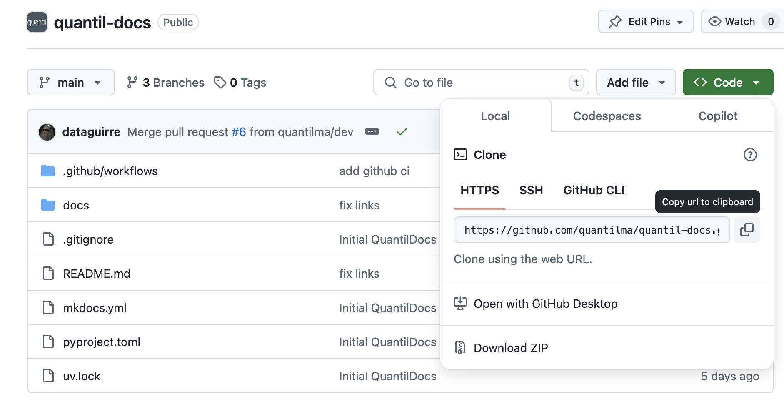

# Flujo de trabajo y mejores prácticas
<!-- En el futuro flujo de trabajo se explica como se trabaja en equipo, pull requests, cuantas personas deben ser reviewers, conventional commits, lo que ocurre en CI/CD, etc -->
### Descargar uv
Dado que las plantillas usan `uv` para CI/CD, recetas con `make` y para replicación de ambientes con el archivo `uv.lock`, se recomienda fuertemente su uso. 
=== "Linux/MacOS"
	``` console
	curl -LsSf https://astral.sh/uv/install.sh | sh	
	```
=== "Windows"
	```console
	powershell -c "irm https://astral.sh/uv/install.ps1 | iex"
	```
Revisar que la instalación se haya completado con:
```
uv --version
```
## Crear un nuevo proyecto
Esta sección es dirigida al responsable de crear la arquitectura del proyecto usando alguna plantilla. Se sugiere que sea el **líder del proyecto** que configure correctamente la plantilla y cargue el repositorio a github.

**TODO**

### Paso 1: 
## Entrar a un proyecto
Si ya existe un repositorio (que se creó usando alguna plantilla) y entra un nuevo integrante, estos son los pasos a seguir:

### Paso 1: Configurar usuario de Git  
Si es la primera vez que usas Git, debes configurar tu usuario y correo desde la terminal con los siguientes comandos: 

```
git config --global user.name "Tu Nombre"
git config --global user.email "tuemail@example.com"
``` 

### Paso 2: Clonar el repositorio
Una vez configurado el usuario, debes clonar el repositorio. Esto descargará el proyecto en tu computador. La URL del repositorio se puede encontrar en GitHub, en la página principal del proyecto, haciendo click en el botón `Code` y copiando el enlace HTTPS. 

La url la debes usar para clonar el repositorio desde una terminal con el siguiente comando:
```
git clone <url>
``` 

### Paso 3: Configurar la rama para trabajar
Después de clonar el repositorio, debes entrar a la carpeta creada y cambiar a la rama `dev`, o a la rama indicada por el líder del proyecto:
```
cd <nombre-del-repositorio>
git checkout dev
```

### Paso 4: Subir cambios
Una vez que quieras subir cambios al repositorio, debes verificar primero el estado de los archivos. Esto mostrará todos los cambios que has realizado:
```
git status
```
Luego, se deben agregar todos los archivos modificados:
```
git add .
```
Una vez agregados los cambios debes realizar un commit, en donde se pide un mensaje que resume los cambios que se subirán al repositorio.
```
git commit -m "Descripción corta de los cambios realizados"
```
Por último debes subir los cambios a la rama `dev`:

```
git push origin dev
```

### Paso 5: Actualizar cambios del repositorio
Antes de hacer cambios o subir nuevos archivos, es importante asegurarse de que tienes la última versión del código del repositorio. Para ello, usa el siguiente comando dentro de la carpeta del repositorio:
```
git pull origin dev
```
Esto descargará los cambios más recientes de la rama dev y los integrará en tu versión local. Si hay conflictos entre tu código y los cambios remotos, Git te pedirá que los resuelvas antes de continuar.

!!! note "Practica comandos de Git"
    
    Para mejorar tu manejo de Git, te recomendamos este [juego tutorial](https://githowto.com/setup) que te ayudará a entender los principales comandos de Git y este [juego interactivo](https://learngitbranching.js.org/) para practicar el manejo de ramas de forma visual y dinámica.